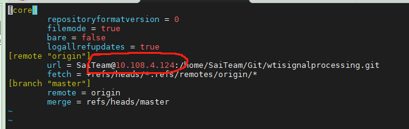

一、基础知识：https://www.liaoxuefeng.com/wiki/896043488029600/
了解：

1. 工作区、暂存区、版本区概念
2. 常用命令：添加、提交、修改等命令
3. 解决冲突问题

二、服务器端：https://www.cnblogs.com/daner1257/p/10761849.html
客户端配置方法：

1. ssh-keygen -t rsa 生成密钥
2. cd ~/.ssh/
3. scp -r id_rsa.pub SaiTeam@10.108.4.124:/home/SaiTeam 密钥上传到服务器git用户home目录下
4. passwd： 123
6. ssh SaiTeam@10.108.4.124
7. passwd: 123
8. cat id_rsa.pub >> .ssh/authorized_keys 客户端公钥导入验证文件
9. ctrl+d
10. git clone SaiTeam@10.108.4.124:/home/SaiTeam/Git/wtisignalprocessing.git（提示：不需要输入服务端密码说明验证成功）
11. git config --global user.name "yourname"
12. git config --global user.email "youremail"

三、客户端：https://blog.csdn.net/weixin_38023551/article/details/105785223
常用命令：

1. 提交

```shell
   git add <file> 
   git commit -m <message> # 提交到仓库并添加备注信息
   git push origin master  # 提交到远程仓库
```

2. 查看

```shell
   git status # 查看工作区状态 
   git diff # 查看修改内容
```

3. 修改

```shell
   git checkout -- file # 丢弃工作区修改
   git reset HEAD <file> # 添加到暂存区丢弃修改
   git reset --hard commit_id # 提交到版本库
```

4. 解决冲突：

*提交代码的时候，一定要先拉取代码*

注：对应于vscode中具体操作查看上述客户端相关链接

5. 服务端IP地址变化：

- 重复步骤**二**
- 同时修改自己工程下的 Yourproject/.git/config 文件中的IP地址为为更新后的IP地址
  

